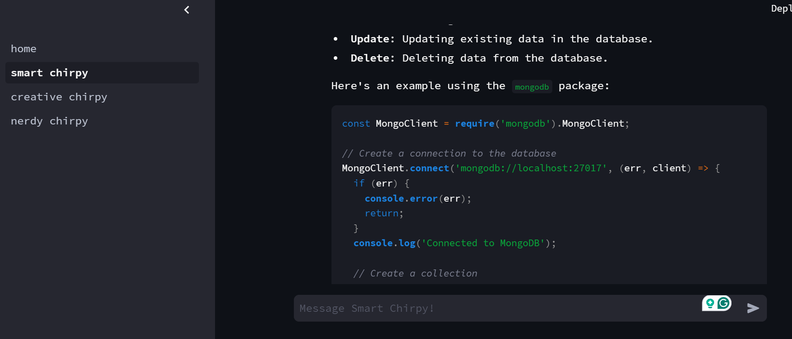
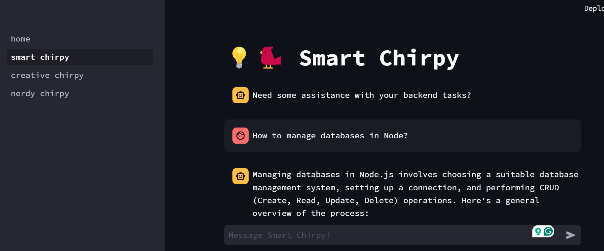
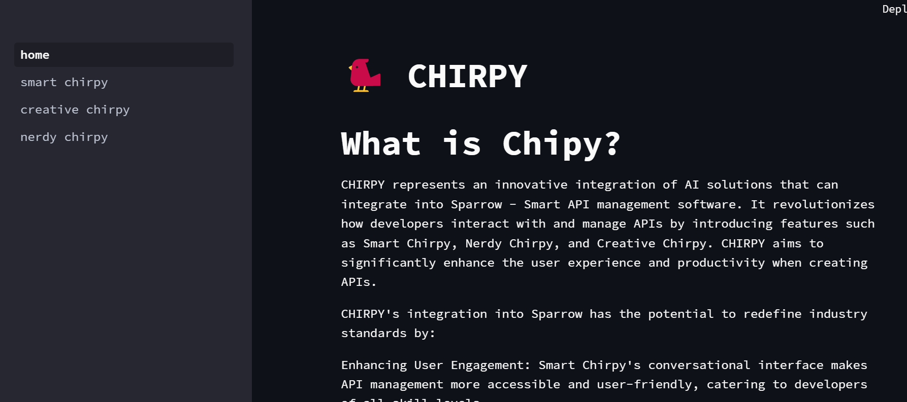
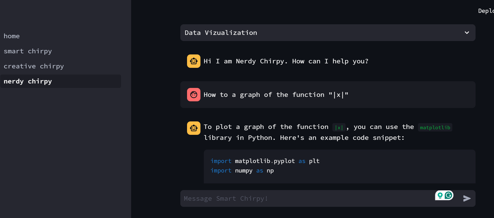
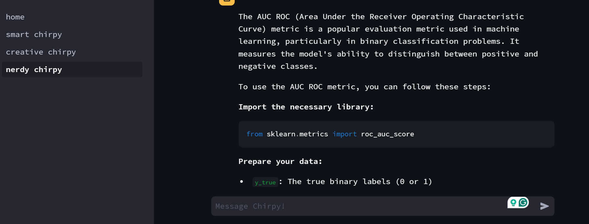
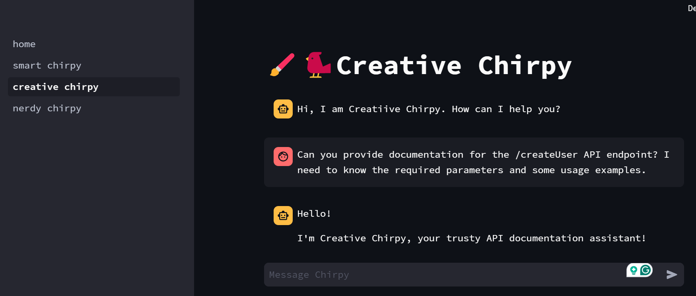
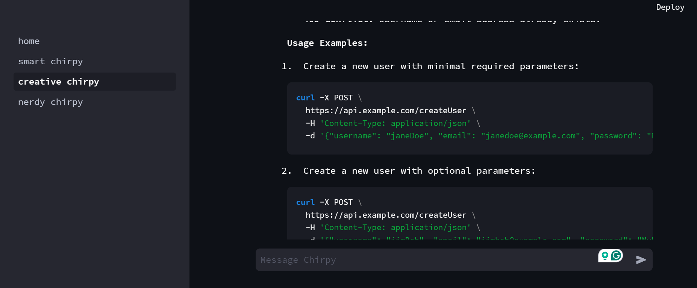

# Chirpy
CHIRPY represents an innovative integration of AI solutions that can integrate into Sparrow - Smart API management software. It revolutionizes how developers interact with and manage APIs by introducing features such as Smart Chirpy, Nerdy Chirpy, and Creative Chirpy. 

# To use the App
Clone the repository on your local machine
```git clone https://github.com/devroopsaha744/Chirpy.git```

Now create a virtual environment and activate it (in the project directory)
```bash 
virtualenv venv
```

```bash 
path\to\your\project\directory\venv\Scipts\activate
```

Install the dependencies listed in the requirements.txt file
```bash
pip install -r requuirements.txt

```


Run this following command:
```bash 
streamlit 1_home.py
```















